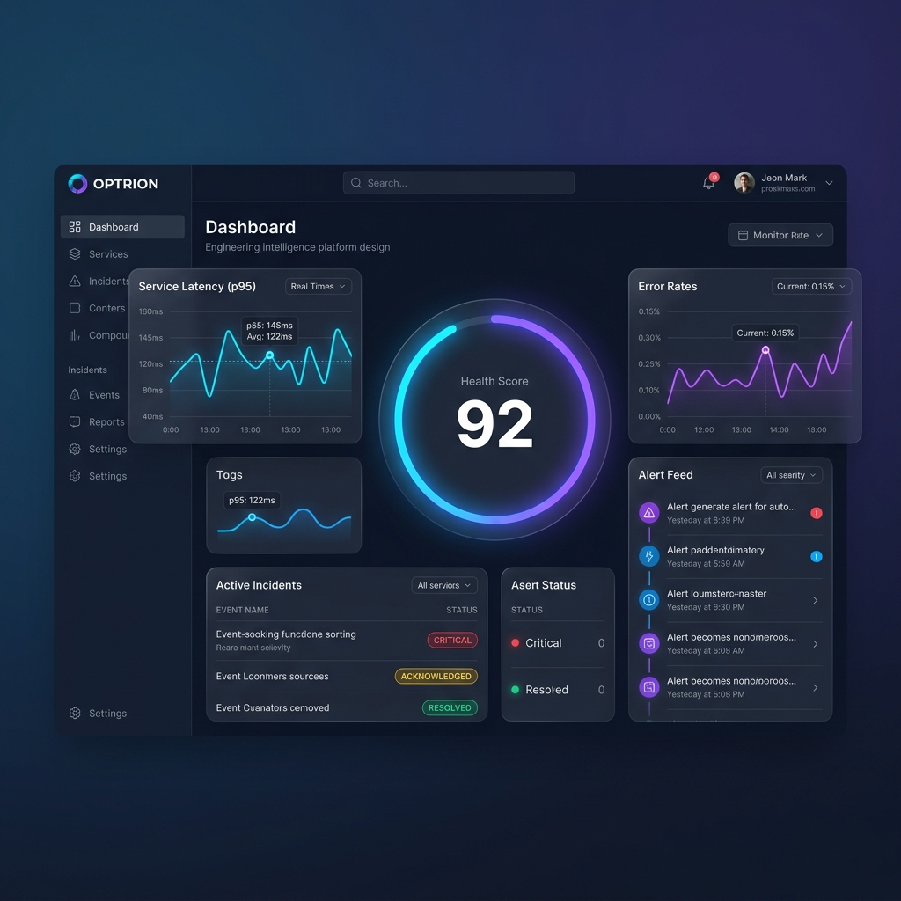

# OPTRION — Engineering Intelligence Platform

[](https://go.dev)
[](https://www.postgresql.org/)
[](https://redis.io/)
[](LICENSE)

**OPTRION** is an engineering intelligence platform that provides real-time health monitoring, intelligent scoring, incident detection, and automated alerting for distributed software systems.

Built for engineering teams who need visibility into the health of their services without the complexity of enterprise observability tools.



---

## What It Does

| Capability | Description |
|-----------|-------------|
| **Health Monitoring** | Pull-based HTTP/TCP/DNS health checks with configurable intervals |
| **Intelligent Scoring** | Deterministic health scoring (0-100) with hierarchical composition |
| **Incident Detection** | Event-sourced incident lifecycle with deduplication and correlation |
| **Smart Alerting** | Threshold-based alerts with cooldown, escalation policies, and Telegram notifications |
| **AI Root Cause Analysis** | Multi-provider AI integration (Gemini, OpenAI, Anthropic, Ollama) for automated diagnostics |
| **Recommendations Engine** | Evidence-based operational recommendations with confidence scoring |
| **Auto-Discovery** | Automatic detection of PostgreSQL, Redis, and HTTP services |
| **Multi-Tenant** | Tenant isolation via PostgreSQL Row-Level Security |
| **API-First** | RESTful API with scoped API key authentication (SHA-256 hashed) |
| **Dashboard** | Real-time Next.js dashboard with health visualization and incident war room |
| **CLI** | Plug-and-play CLI for init, register, and verify workflows |
| **SDKs** | Go and JavaScript SDKs for integration |

---

## Architecture

```
┌─────────────────────────────────────────────────────────────────────────┐
│                          OPTRION PLATFORM                                │
│                                                                         │
│  ┌──────────┐  ┌──────────┐  ┌──────────┐  ┌──────────────────────┐   │
│  │  Tenant  │  │ Catalog  │  │Execution │  │    Intelligence      │   │
│  │          │  │          │  │          │  │                      │   │
│  │ API Keys │  │ Products │  │ Health   │  │ Scoring + Anomaly    │   │
│  │ Plans    │  │ Envs     │  │ Checks   │  │ AI Root Cause        │   │
│  │ Quotas   │  │ Comps    │  │ Results  │  │ Recommendations      │   │
│  └──────────┘  └──────────┘  └────┬─────┘  └──────────┬───────────┘   │
│                                    │ events             │ events        │
│                                    ▼                    ▼               │
│  ┌──────────────────┐  ┌────────────────────────────────────────────┐  │
│  │   Notification   │◀─│           Alerting / Incident               │  │
│  │                  │  │                                            │  │
│  │  Telegram        │  │  Event-Sourced State Machine               │  │
│  │  Escalation      │  │  Deduplication, Correlation, Cooldowns    │  │
│  └──────────────────┘  └────────────────────────────────────────────┘  │
│                                                                         │
│  ┌──────────────────────────────────────────────────────────────────┐  │
│  │                    Platform Services                              │  │
│  │  Event Bus (Outbox) │ Circuit Breaker │ Rate Limiting │ RLS      │  │
│  └──────────────────────────────────────────────────────────────────┘  │
└─────────────────────────────────────────────────────────────────────────┘

┌──────────────────────┐    ┌──────────────────────┐
│   Next.js Dashboard  │    │   CLI (optrion-cli)  │
│   War Room, Health,  │    │   init / register /  │
│   Topology, AI View  │    │   verify             │
└──────────────────────┘    └──────────────────────┘
```

**Design Principles:**
- **Modular Monolith** — Single deployable binary with bounded context isolation
- **Hexagonal Architecture** — Domain logic has zero infrastructure dependencies
- **Domain-Driven Design** — Aggregates, value objects, domain events
- **Event-Driven** — In-process event bus with PostgreSQL outbox pattern + idempotency
- **Security-First** — SHA-256 API keys, RLS, brute-force protection, security headers

---

## Tech Stack

| Layer | Technology |
|-------|-----------|
| Language | Go 1.23 |
| Database | PostgreSQL 16 (pgx, connection pooling, RLS) |
| Cache | Redis 7 (rate limiting, cooldowns) |
| HTTP | Standard library `net/http` + custom middleware |
| Logging | `log/slog` (structured JSON, correlation IDs) |
| Config | Environment variables with validation |
| Deployment | Docker Compose (single VPS) |
| Testing | Standard `testing` package, table-driven tests, E2E suites |
| Dashboard | Next.js 15, TailwindCSS, Framer Motion, TanStack Query |
| AI Providers | Gemini, OpenAI, Anthropic, Ollama (with circuit breaker) |

---

## Project Structure

```
optrion/
├── cmd/
│   ├── optrion/             # Server entry point (graceful shutdown)
│   └── optrion-cli/         # CLI tool (init, register, verify)
├── internal/
│   ├── app/                 # DI container (composition root)
│   ├── tenant/              # Multi-tenancy (products, envs, components, API keys, audit)
│   ├── health/              # Health monitoring (collectors, scoring, anomaly detection)
│   ├── incident/            # Event-sourced incident lifecycle (state machine, dedup)
│   ├── alert/               # Alerting (rules, channels, escalation, Telegram)
│   ├── ai/                  # AI root cause analysis (4 providers + resilient wrapper)
│   ├── recommendation/      # Evidence-based recommendations (ranking, safety validation)
│   ├── registration/        # Bulk registration workflow
│   ├── autodiscovery/       # Auto-detect PostgreSQL, Redis, HTTP services
│   ├── validation/          # Integration validation
│   ├── config/              # YAML config loading (CLI)
│   ├── platform/            # Cross-cutting infrastructure
│   │   ├── config/          # Environment-based configuration
│   │   ├── logger/          # Structured logging (slog + correlation IDs)
│   │   ├── database/        # PostgreSQL pool + health checks
│   │   ├── cache/           # Redis client + health checks
│   │   ├── server/          # HTTP server, router, auth, rate limiting, RLS
│   │   ├── eventbus/        # In-process event bus + outbox pattern
│   │   ├── circuitbreaker/  # Circuit breaker for external calls
│   │   └── observability/   # Metrics export
│   └── shared/              # Shared kernel (UUID v7, domain errors)
├── dashboard/               # Next.js 15 dashboard (health, incidents, topology, AI)
├── sdk/
│   ├── go-sdk/              # Go client SDK
│   └── js-sdk/              # JavaScript client SDK
├── migrations/              # 27 versioned SQL migrations (embedded)
├── test/
│   ├── e2e/                 # Go E2E tests (14 test files)
│   ├── e2e-playwright/      # Playwright API + UI tests
│   └── testutil/            # Docker-based test infrastructure
├── scripts/                 # Seed scripts
├── deploy/docker/           # Dockerfile + docker-compose
├── examples/                # Integration examples (Go, Node.js, YAML)
├── Makefile                 # Build automation
└── go.mod                   # Go module (214 .go files, ~26K lines)
```

---

## Quick Start

### Prerequisites

- Go 1.23+
- Docker & Docker Compose
- Make (optional)

### 1. Clone

```bash
git clone https://github.com/mdshoaibumer/OPTRION.git
cd OPTRION
```

### 2. Start Infrastructure

```bash
make infra-up
# Starts PostgreSQL on :5432 and Redis on :6379
```

### 3. Run the Application

```bash
# Option A: Using Make
make run

# Option B: Direct
source .env.local  # or manually export env vars on Windows
go run ./cmd/optrion
```

### 4. Verify

```bash
# Liveness probe
curl http://localhost:8080/healthz

# Readiness probe (checks DB + Redis)
curl http://localhost:8080/readyz

# Application info
curl http://localhost:8080/api/v1/info
```

### 5. Run Tests

```bash
make test
# or
go test ./... -v -count=1
```

### 6. Full Docker Stack

```bash
make docker-up
# Builds and starts: app + postgres + redis
# App available at http://localhost:8080
```

---

## Available Make Commands

| Command | Description |
|---------|-------------|
| `make build` | Build the binary |
| `make run` | Build and run locally |
| `make test` | Run all tests |
| `make test-cover` | Run tests with coverage report |
| `make lint` | Run golangci-lint |
| `make docker-up` | Start full Docker stack |
| `make docker-down` | Stop Docker stack |
| `make infra-up` | Start only PostgreSQL + Redis |
| `make clean` | Remove build artifacts |

---

## API Endpoints

### Platform

| Method | Path | Description |
|--------|------|-------------|
| `GET` | `/healthz` | Liveness probe (always 200) |
| `GET` | `/readyz` | Readiness probe (checks all deps) |
| `GET` | `/api/v1/info` | Application version + environment |

### Tenant Management

| Method | Path | Description |
|--------|------|-------------|
| `POST` | `/api/v1/tenants` | Create tenant |
| `GET` | `/api/v1/tenants/{id}` | Get tenant by ID |
| `GET` | `/api/v1/tenants` | List tenants |
| `POST` | `/api/v1/products` | Create product |
| `POST` | `/api/v1/environments` | Create environment |
| `POST` | `/api/v1/components` | Register component |

### Health Monitoring

| Method | Path | Description |
|--------|------|-------------|
| `GET` | `/api/v1/health/summary?tenant_id=` | Overall health summary |
| `GET` | `/api/v1/health/components?tenant_id=` | Component health statuses |
| `GET` | `/api/v1/health/history?tenant_id=` | Historical health scores |
| `GET` | `/api/v1/health/anomalies?tenant_id=` | Detected anomalies |

### Incidents

| Method | Path | Description |
|--------|------|-------------|
| `POST` | `/api/v1/incidents` | Create incident |
| `GET` | `/api/v1/incidents` | List incidents (with filtering) |
| `GET` | `/api/v1/incidents/{id}` | Get incident details |
| `POST` | `/api/v1/incidents/{id}/acknowledge` | Acknowledge incident |
| `POST` | `/api/v1/incidents/{id}/resolve` | Resolve incident |
| `POST` | `/api/v1/incidents/{id}/comments` | Add comment |

### Alerting

| Method | Path | Description |
|--------|------|-------------|
| `POST` | `/api/v1/alerts/rules` | Create alert rule |
| `GET` | `/api/v1/alerts/rules` | List alert rules |
| `POST` | `/api/v1/alerts/channels` | Create notification channel |
| `GET` | `/api/v1/alerts` | List triggered alerts |

### AI & Recommendations

| Method | Path | Description |
|--------|------|-------------|
| `POST` | `/api/v1/ai/analyze` | Trigger AI root cause analysis |
| `GET` | `/api/v1/ai/analyses/{id}` | Get analysis results |
| `GET` | `/api/v1/recommendations` | List recommendations |

### Registration (Plug & Play)

| Method | Path | Description |
|--------|------|-------------|
| `POST` | `/api/v1/registration/bulk` | Bulk register tenant + components |

---

## Health Monitoring

OPTRION's Health Monitoring Engine provides continuous, automated assessment of system health.

### How It Works

1. **Collectors** pull metrics from each component (HTTP endpoints, PostgreSQL, Redis, server resources)
2. **Scheduler** runs collectors at configurable intervals (30s-60s per collector type)
3. **Scoring Engine** applies rule-based evaluation to compute a 0-100 health score
4. **Anomaly Detector** uses statistical z-score analysis (3σ threshold) to identify unusual behavior
5. **REST API** exposes real-time summaries, component statuses, and anomaly history

### Collector Types

| Collector | Metrics | Interval |
|-----------|---------|----------|
| **Backend** | availability, response_time, error_rate, throughput, uptime | 30s |
| **PostgreSQL** | connection_status, query_latency, active_connections, slow_queries, deadlocks, index_usage, pool_health | 60s |
| **Redis** | availability, memory_usage, hit_ratio, evictions, connected_clients | 60s |
| **Server** | cpu, ram, disk, load_average, network | 60s |

### Scoring

Health scores are computed per-component using configurable rules:
- **100** = Perfectly healthy
- **≥90** = Healthy (no action needed)
- **70-89** = Degraded (investigate)
- **<70** = Critical (immediate action)

### Anomaly Detection

Uses a rolling window (60 samples) with z-score analysis:
- **>3σ** deviation = Medium anomaly
- **>4σ** deviation = High anomaly
- **>5σ** deviation = Critical anomaly

### Example Response

```json
// GET /api/v1/health/summary?tenant_id=<uuid>
{
  "tenant_id": "0194ffa0-...",
  "overall_score": 92,
  "overall_status": "healthy",
  "components": 4,
  "healthy": 3,
  "degraded": 1,
  "critical": 0,
  "reasons": ["Query latency 120ms exceeds 100ms threshold"],
  "last_updated_at": "2026-01-15T10:30:00Z"
}
```

---

## Seeding Test Data

```bash
# 1. Start infrastructure
make infra-up

# 2. Run the application
make run

# 3. In another terminal, seed tenant hierarchy
go run scripts/seed/seed.go

# 4. Seed health metric definitions (requires PostgreSQL access)
go run scripts/seed-health/main.go
```

---

## Configuration

All configuration is done via environment variables. See [`.env.local`](.env.local) for the full list.

| Variable | Default | Description |
|----------|---------|-------------|
| `APP_ENV` | `local` | Environment (local/development/production) |
| `HTTP_PORT` | `8080` | HTTP server port |
| `DB_HOST` | `localhost` | PostgreSQL host |
| `DB_PORT` | `5432` | PostgreSQL port |
| `DB_NAME` | `optrion` | Database name |
| `REDIS_HOST` | `localhost` | Redis host |
| `LOG_LEVEL` | `info` | Log level (debug/info/warn/error) |
| `LOG_FORMAT` | `json` | Log format (json/text) |

Production requires `DB_SSL_MODE != disable` and `DB_PASSWORD` to be set.

---

## Implementation Roadmap

| Phase | Status | Milestone |
|-------|--------|-----------|
| 1 | ✅ Complete | Foundation (config, logging, DB, Redis, HTTP, Docker) |
| 2 | ✅ Complete | Tenant bounded context (multi-tenant, products, envs, components) |
| 3 | ✅ Complete | Health Monitoring Engine (collectors, scoring, anomaly detection) |
| 4 | ✅ Complete | Incident detection (event-sourced state machine, deduplication, correlation) |
| 5 | ✅ Complete | Alerting + Notifications (rules, escalation, Telegram, cooldowns) |
| 6 | ✅ Complete | API authentication (SHA-256 hashed keys, brute-force protection, RLS) |
| 7 | ✅ Complete | AI Root Cause Analysis (Gemini, OpenAI, Anthropic, Ollama + circuit breaker) |
| 8 | ✅ Complete | Recommendation Engine (evidence-based, safety validation, ranking) |
| 9 | ✅ Complete | Dashboard (Next.js 15 — health, incidents, topology, AI views) |
| 10 | ✅ Complete | CLI + SDKs (plug-and-play onboarding, Go SDK, JS SDK) |
| 11 | ✅ Complete | Platform hardening (event bus, outbox, rate limiting, observability) |

---

## Design Documents

Detailed architecture documentation available in the repository:

- [`ARCHITECTURE_REVIEW.md`](ARCHITECTURE_REVIEW.md) — System architecture, risks, and decisions
- [`DOMAIN_MODEL.md`](DOMAIN_MODEL.md) — DDD domain model (entities, aggregates, events)
- [`DATABASE_ARCHITECTURE.md`](DATABASE_ARCHITECTURE.md) — Schema design, indexes, partitioning
- [`GO_ARCHITECTURE.md`](GO_ARCHITECTURE.md) — Go codebase structure, dependency rules
- [`API_CONTRACTS.md`](API_CONTRACTS.md) — REST API contracts, error model
- [`IMPLEMENTATION_STRATEGY.md`](IMPLEMENTATION_STRATEGY.md) — Execution roadmap
- [`PLUGANDPLAY_GUIDE.md`](PLUGANDPLAY_GUIDE.md) — CLI onboarding guide

---

## Project Stats

| Metric | Value |
|--------|-------|
| Go source files | 214 |
| Lines of Go code | ~26,000 |
| Bounded contexts | 10 |
| Database migrations | 27 |
| Test files | 64 (unit + E2E) |
| API endpoints | 30+ |
| AI providers supported | 4 |
| Dashboard pages | 6 |

---

## Security

- SHA-256 hashed API keys (never stored in plaintext)
- Brute-force protection (5 failures → 15-min IP lockout)
- Timing-attack resistant authentication (`subtle.ConstantTimeCompare`)
- PostgreSQL Row-Level Security on all tenant tables
- Security headers (HSTS, CSP, X-Frame-Options, etc.)
- 1MB request body limit with strict JSON validation
- Non-root Docker container (Alpine 3.20)
- Multi-stage build with stripped symbols

---

## First Customer

**GymFlow Track** — A gym management platform. OPTRION monitors their services (payment processing, booking system, member portal) and alerts the team via Telegram when things degrade.

---

## License

OPTRION is licensed under the [GNU Affero General Public License v3.0 (AGPL-3.0)](LICENSE).

If you modify OPTRION and provide it as a network service, you must make the modified source code available under the AGPL-3.0.

Commercial licensing and dedicated enterprise support may be available in the future.

---

## Author

Built by a solo engineer, after work hours, one bounded context at a time.

**Architecture:** Domain-Driven Design • Hexagonal Architecture • Event Sourcing • CQRS patterns  
**Practices:** SOLID principles • Clean Architecture • Security-first • Comprehensive testing
